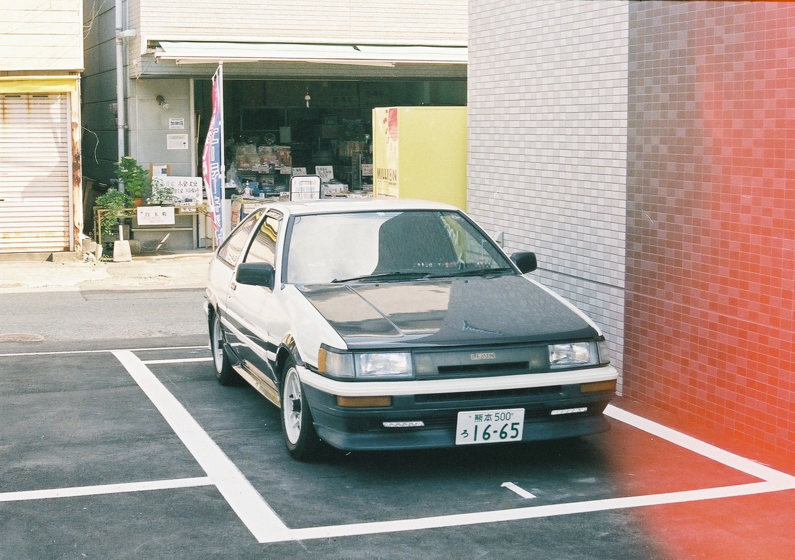
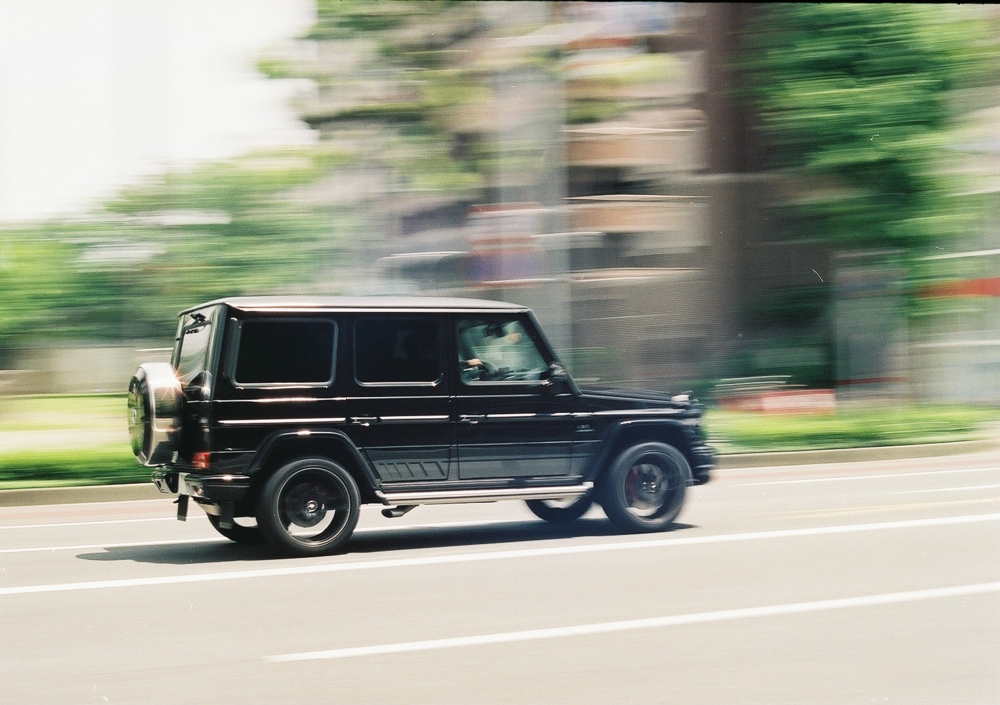
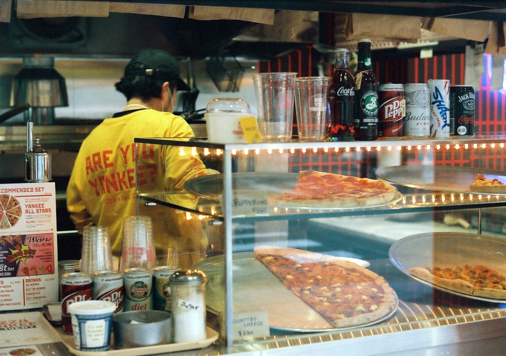
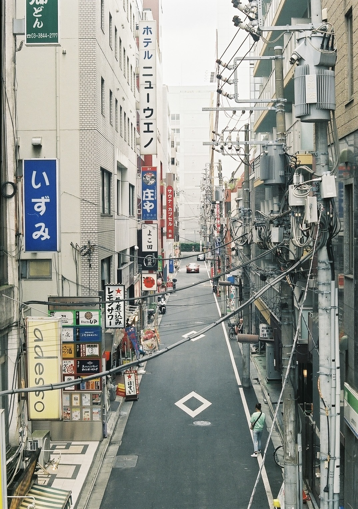
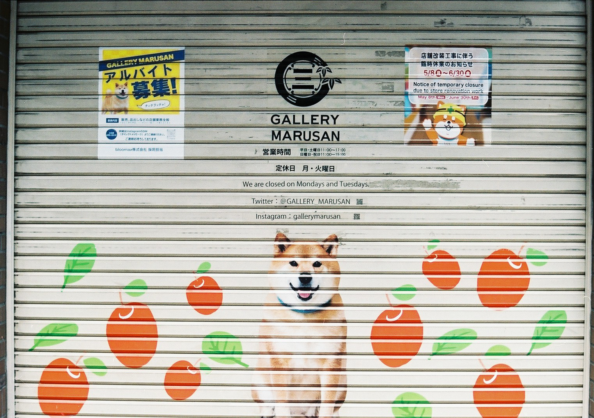

These photos were taken during my stay in Kumamoto, as well as when I visited friends in Tokyo.

**Film:** Fujifilm Superia X-TRA 400 (135, 400 ISO)

**Camera:** Fujica ST605

# Gallery


  
  
  
  
  


 

# One by one

This was just a cool car... also take note of the light leaks in some of these images. I had some trouble rewinding which lead to the exposure of the film to sunlight.

Speaking of cars! I tried to follow through with the car whils taking this image and I was surprised I managed to keep the car in focus. When you're tracking a subject, it was difficult to know when I should release the shutter!

")

I loved the attention to detail this place had, especially as they sold NY style pizza here. Speaking from the future, it closed down in December 2023, and maybe marked the worst way to start the new year...

Moving to Tokyo now, I loved the narrow-ness looking down into the street. A car pulled in at just the right time centering itself in the image.

This was my first attempt at visiting my Instagram idol's shop! Too bad it was close for rennovation. Also speaking from the future, Maru-san passed away in early 2024, he was an old doggo.
