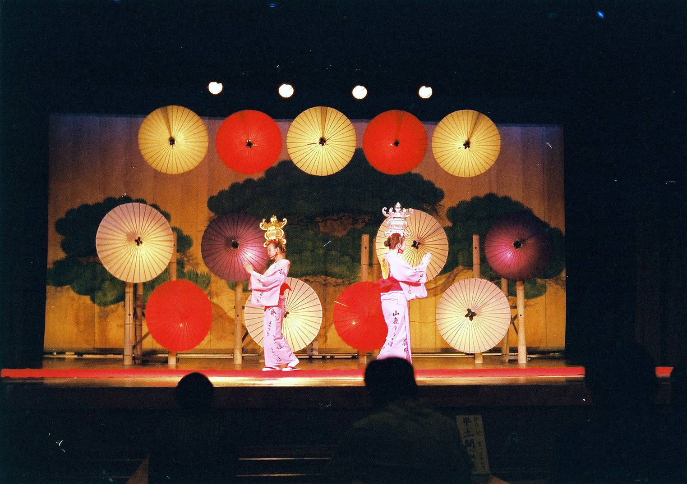
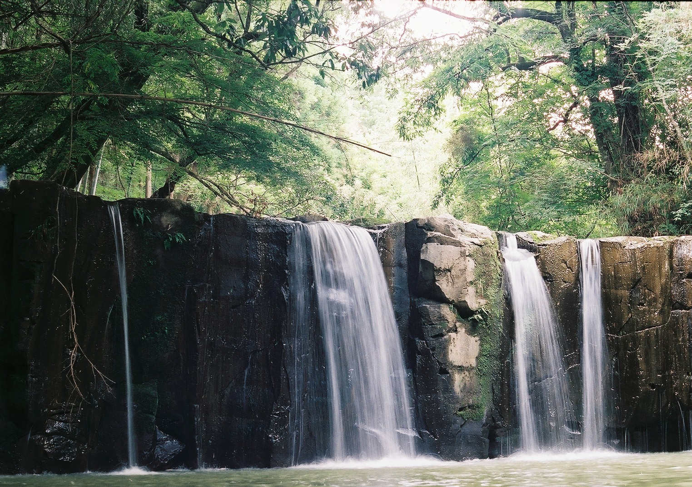
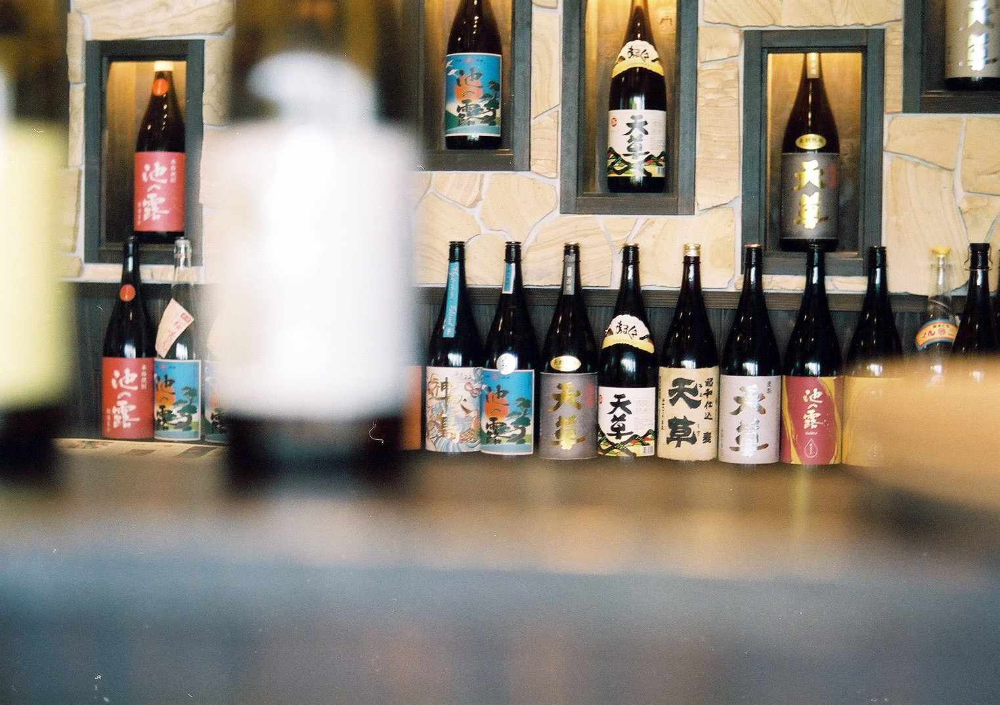
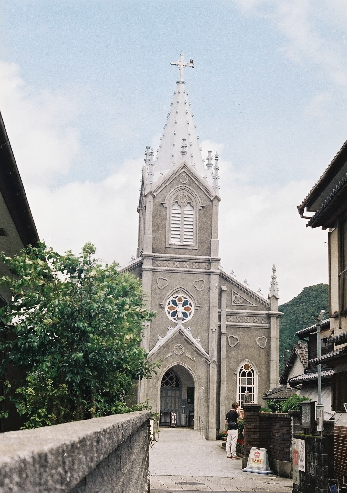
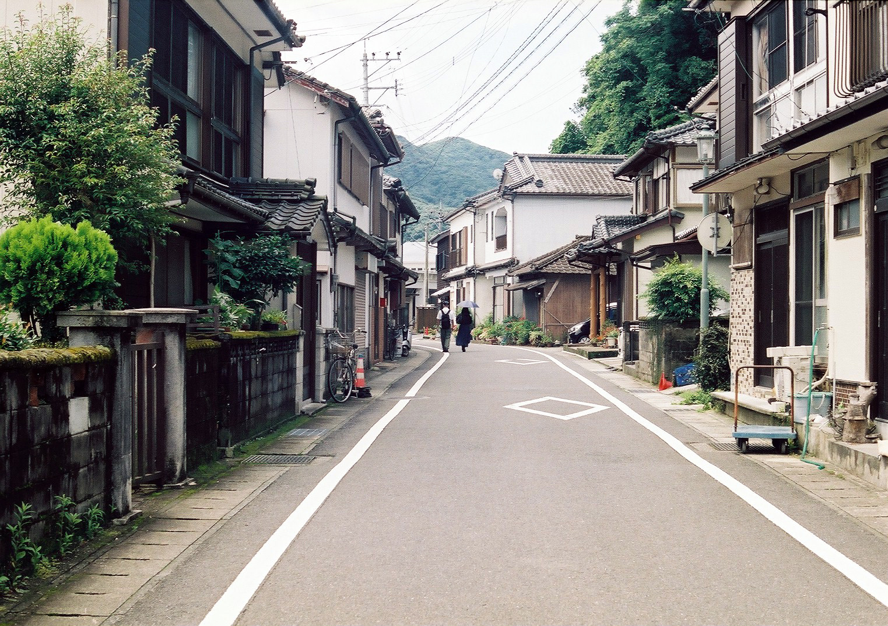
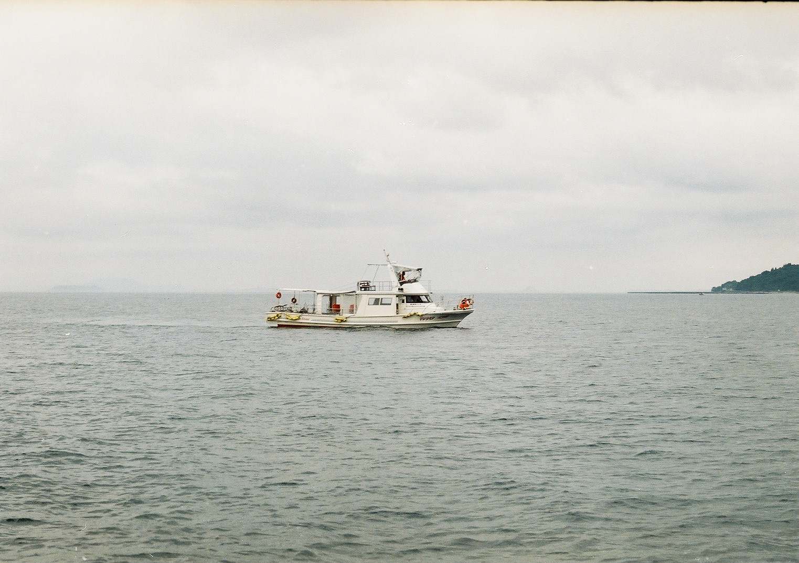

These photos were taken on my trip to a small island off the cost of Kumamoto, Japan. Located in Japan's southern Kyushu island, it's quite far away from the reach of Japan's larger international cities, making it a little quieter.

**Film:** Fujifilm Superia X-TRA 400 (135, 400 ISO)

**Camera:** Fujica ST605

# Gallery


  
  
  
  
  
  


 

# One by one

Here you can see some of this film's lowlight capabilities. You really still have to keep the camera still. I had the shutter speed on 1/30 and rested the camera on my knee before taking the shot.

This was my first attempt at doing a long exposure shot to get the silk-like appearance of the waterfall. I rested the camera on some rocks and adjusted the ISO slightly over the film's rating to try and not let it get overexposed. I think it turned out quite well!

I wanted to play around with the different aperature sizes here to get the trendy "out of focus" effect, and so I decided to take a photo of the bottles in the background.

Given how we hold these cameras, I feel like we don't get enough opportunity, nor affordability to take vertical photos. The day was quite overcast, but definitely still a bright day nonetheless.

Perhaps you wouldn't be able to normally tell, but its nice to see these quaint looking streets in Japan. I wish I had taken less of the road, with more sky in this one. Given I was on an incline, I just had my focal point set on the people in the background.

With these cameras, a higher shutter speed would surely capture the image without much motion blur added to it. I suppose it needs to be used in conjunction with a higher speed film too. I wish the weather had been better, it was very windy that day. Although I'm glad the rocking boat didn't cause too much issue.