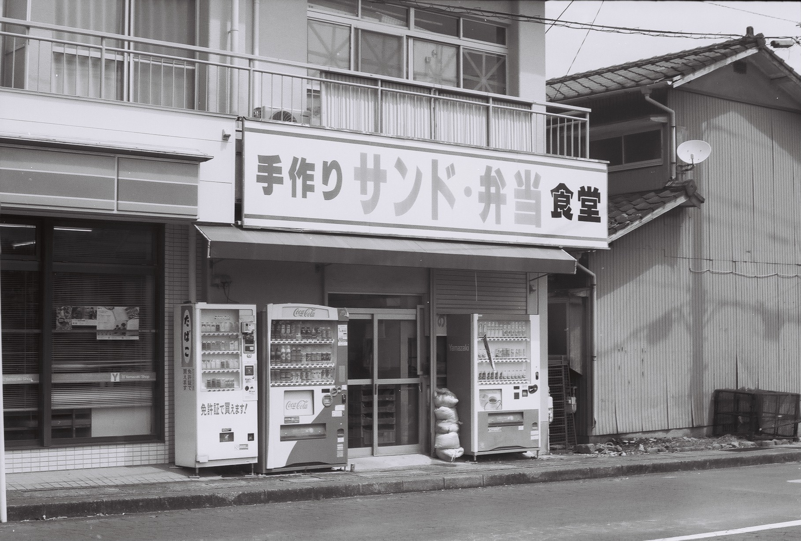
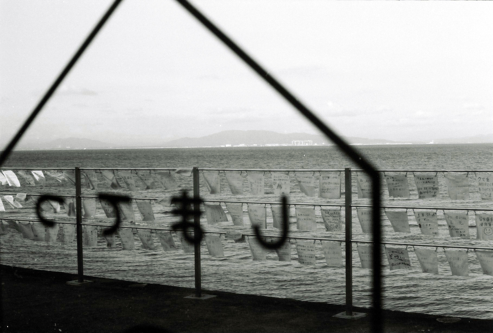
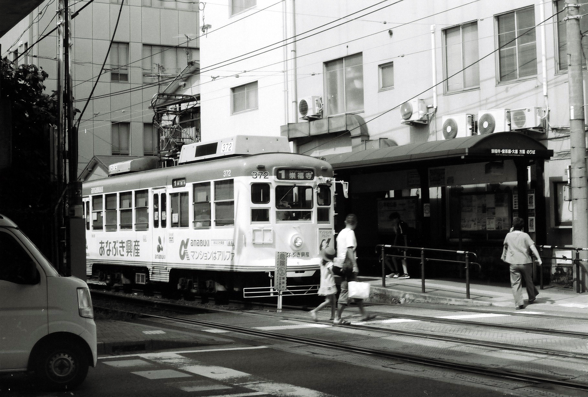
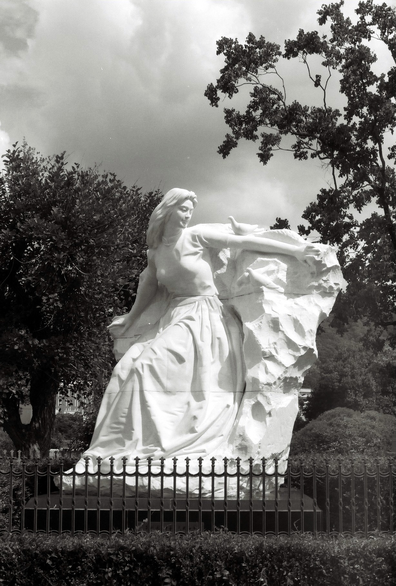
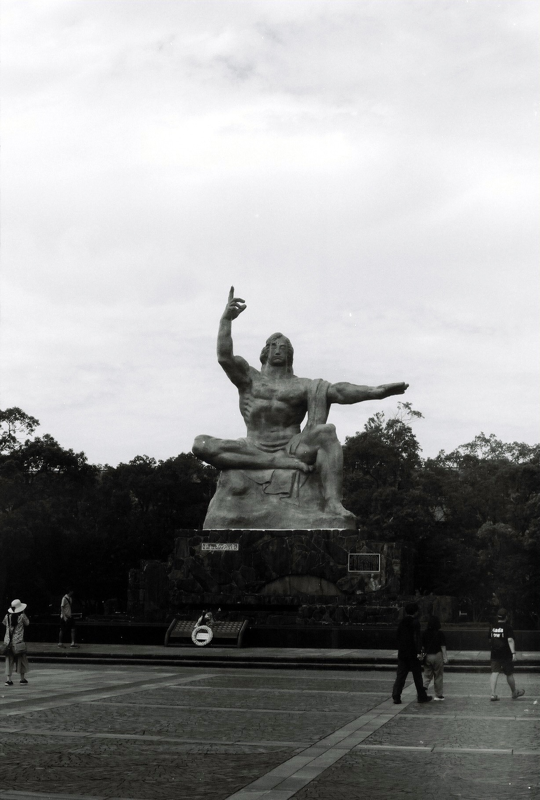
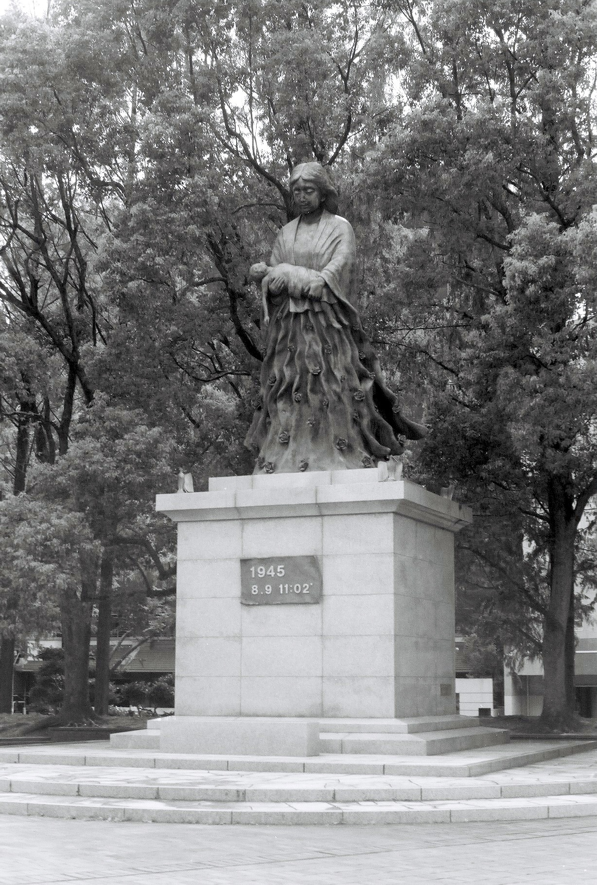
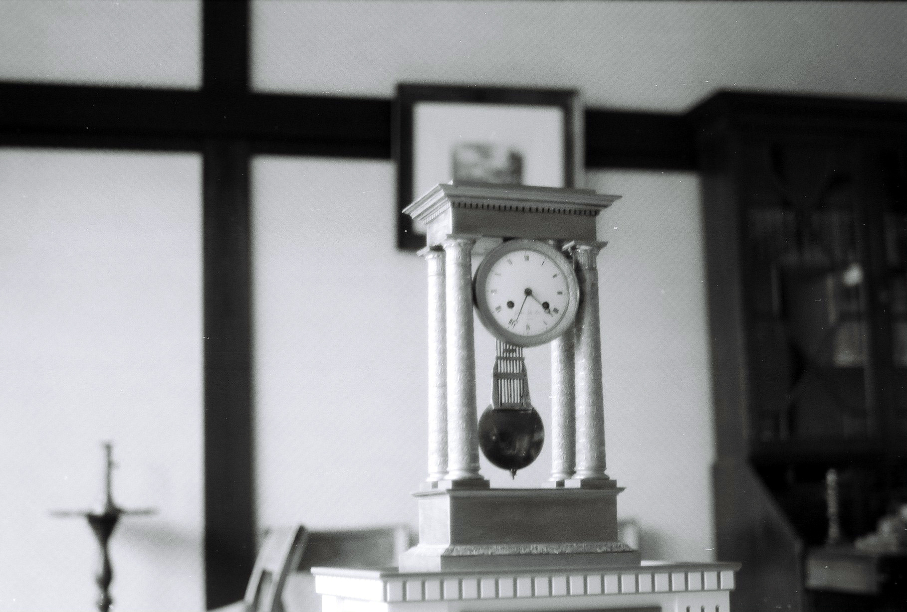

These photos were taken on my trip to the port city of Nagasaki, Japan. We traveled via Simabara which is accessible via ferry from Kumamoto. Then you'll need to use the local train network towards Nagasaki and change to a JR train to get you to the terminus station.

A place full of history.

**Film:** Fujifilm Neopan 100 (135, 100 ISO, Black and White)

**Camera:** Fujica ST605

# Gallery


  
  
  
  
  
  
  


 

# One by one

Even in the remotest of places, you can surely find something slightly industrial looking. Maybe its all the corregated iron to the right of it.

This was located at Ohmisaki (おみさき) station on our way to Nagasaki. It featured yellow notes tied to the railing. This is one of those shots which would have probably looked a bit better in colour.

Sill + motion is one of my favourite things to play around with on film! This is in one of the busier spots in the city.

This statue of a woman shielding position, with doves was a contribution from China to the Peace Park. There were other donations from all over the world, including Australia. But this one stood out to me the most.

The meaning and motive of this statue was interesting. One hand points to his left, indicating the direction of the bomb's hypocentre, while the other points towards the heavens, which said that peace can only be given by God.

This statue represents the children who were victims of the atomic bombing of Nagasaki, and the mothers who tried to protect them. It features a plaque of the date and time of the bombing.

This one was hard to capture, again in indoor settings with your average film speed, you need to stand really still. This has some motion making it seem in and out of focus.